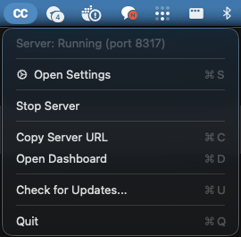
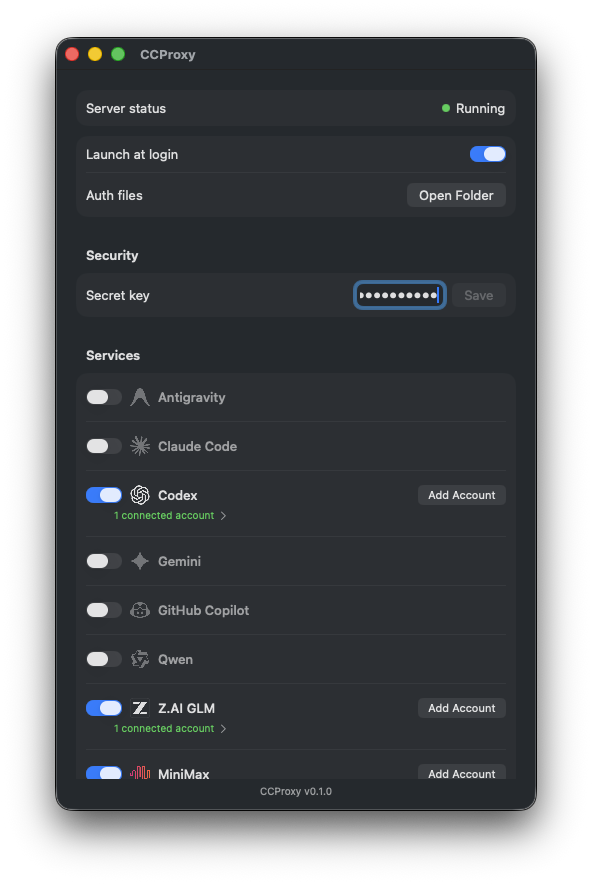

# CCProxy

[English README](./README.md)

> [!IMPORTANT]
> **CCProxy는 [automazeio/vibeproxy](https://github.com/automazeio/vibeproxy)를 가져와서 아주 조금만 수정한 파생 프로젝트입니다.**
> 즉, 이 저장소는 `vibeproxy`를 기반으로 시작했고, 이 레포의 목적에 맞게 소규모 수정만 반영한 프로젝트라는 점을 분명히 밝힙니다.

CCProxy는 AI 코딩 도구용 로컬 프록시를 실행하고, 인증 및 실행 상태를 메뉴바 UI에서 관리할 수 있게 해주는 macOS 네이티브 앱입니다.

기본 사용 흐름은 단순합니다.
- `http://localhost:8317` 에 로컬 프록시 실행
- 메뉴바에서 번들된 backend 시작/중지
- 앱에서 인증 및 설정 관리
- 필요 시 shared secret으로 로컬 프록시 접근 제한

## 이 프로젝트를 만든 이유

이 저장소는 [`automazeio/vibeproxy`](https://github.com/automazeio/vibeproxy)를 바탕으로 만든 **경량 파생 버전**입니다.

처음부터 완전히 새로 만든 프로젝트라고 주장하려는 목적이 아니라,
기존 구조와 접근 방식을 유지하면서 이 저장소에 필요한 몇 가지 수정만 얹어 사용하는 것이 목적입니다.

## CCProxy만의 차별점

CCProxy의 핵심은 **provider 선택지를 넓히는 것**입니다.

`automazeio/vibeproxy`를 기반으로 했지만, CCProxy는 원본에서 기본적으로 지원하지 않던 **Kimi, MiniMax 등의 API 연결**을 추가하고, **로컬 프록시를 중심에 둔 Claude Code 워크플로우**를 더 중요하게 다룹니다.

즉, 하나의 provider에만 묶이는 대신, 로컬 프록시를 경유해 작업에 맞는 여러 provider의 모델을 선택하고 조합해 사용할 수 있습니다.

결국 CCProxy가 지향하는 방향은 단순합니다.
**한 provider에 갇히지 말고, 여러 provider를 유연하게 라우팅해서 쓰자.**

## 원본 / 출처 명시

이 프로젝트는 다음처럼 이해하는 것이 정확합니다.
- `automazeio/vibeproxy` 기반
- 그 위에 소규모 수정만 추가
- 전체적인 앱 구조와 워크플로우도 원본 프로젝트의 흐름을 많이 유지

원본 프로젝트:
- https://github.com/automazeio/vibeproxy

또한 이 프로젝트는 backend / proxy 구성 역시 원본 프로젝트가 사용하던 업스트림 접근을 계속 활용합니다.

## 주요 기능

- macOS 네이티브 메뉴바 앱
- SwiftUI 기반 설정 창
- UI에서 번들 backend 시작/중지
- AI 도구용 로컬 프록시 엔드포인트 제공
- 앱 내부에서 provider/account 관리
- Launch at Login 지원
- Sparkle 기반 업데이트 지원
- 로컬 프록시 요청에 대한 shared secret 검증 지원
- 앱 메뉴에서 management dashboard 열기 지원

## 스크린샷

### 메뉴바


### 설정 창


## 요구 사항

- macOS 13.0 이상
- 로컬 빌드를 위한 Xcode / Swift toolchain

## 설치

### 1) 앱 번들 빌드

```bash
make release
```

출력물:
- `CCProxy.app`

### 2) Applications 폴더에 설치

```bash
make install
```

### 3) 로컬에서 바로 실행

```bash
make run
```

## 개발

### 빌드

```bash
make build
```

### 테스트

```bash
make test
```

### 정리

```bash
make clean
```

## 프로젝트 구조

```text
ccproxy/
├── Makefile
├── create-app-bundle.sh
├── CCProxy.app/                  # 빌드 결과물
└── src/
    ├── Package.swift
    ├── Info.plist
    ├── Sources/
    │   ├── main.swift
    │   ├── AppDelegate.swift
    │   ├── ServerManager.swift
    │   ├── SettingsView.swift
    │   ├── ThinkingProxy.swift
    │   ├── AuthStatus.swift
    │   ├── TunnelManager.swift
    │   ├── IconCatalog.swift
    │   ├── NotificationNames.swift
    │   └── Resources/
    └── Tests/
        └── CCProxyTests/
```

## 핵심 구성 요소

- `src/Sources/AppDelegate.swift` — 앱 라이프사이클, 메뉴바, 설정 창, 업데이트 연동
- `src/Sources/ServerManager.swift` — 번들 backend 실행 제어, config 생성, 인증 관련 상태 관리
- `src/Sources/ThinkingProxy.swift` — 로컬 프록시 리스너 및 요청 포워딩
- `src/Sources/SettingsView.swift` — SwiftUI 설정 화면과 account 관리 UI
- `src/Sources/AuthStatus.swift` — 로컬 인증/account 상태 추적

## 로컬 프록시 인증

CCProxy는 로컬 프록시 요청에 대해 shared secret 검증을 적용할 수 있습니다.

보통 로컬 설정은 다음처럼 사용합니다.

```json
{
  "ANTHROPIC_AUTH_TOKEN": "your-secret",
  "ANTHROPIC_BASE_URL": "http://localhost:8317"
}
```

앱에서 secret key를 설정한 경우, 로컬 프록시 요청은 아래 헤더를 포함해야 합니다.

```http
Authorization: Bearer <secret-key>
```

## 참고 사항

- backend management 포트와 local proxy 포트는 서로 다릅니다.
- 이 저장소는 프로젝트 목적에 맞춘 수정본이므로 canonical upstream으로 보면 안 됩니다.
- 원본 기준 프로젝트가 필요하다면 `automazeio/vibeproxy`를 직접 사용하는 것이 맞습니다.

## 크레딧

- 원본 베이스 프로젝트: [automazeio/vibeproxy](https://github.com/automazeio/vibeproxy)
- upstream proxy/backend 기반: 원본 프로젝트가 사용하던 동일 계열 접근
- Sparkle: https://sparkle-project.org/

## 라이선스

이 저장소의 `LICENSE` 파일을 확인해주세요.
