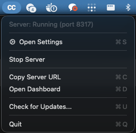
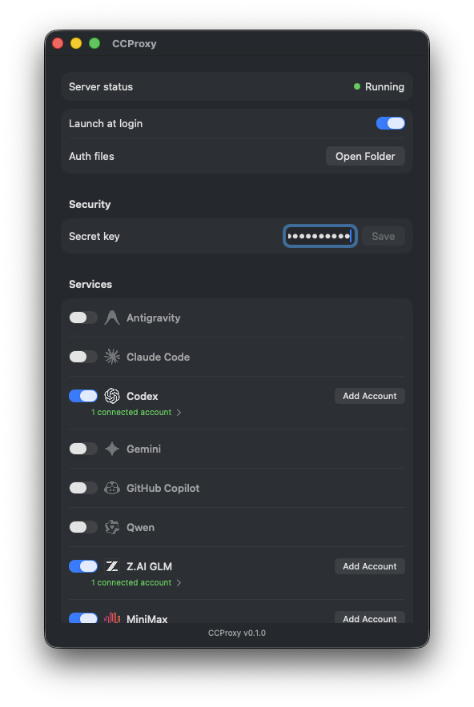

# CCProxy

[English README](./README.md)

> [!IMPORTANT]
> **CCProxy는 [automazeio/vibeproxy](https://github.com/automazeio/vibeproxy)를 가져와서 아주 조금만 수정한 파생 프로젝트입니다.**
> 즉, 이 저장소는 `vibeproxy`를 기반으로 시작했고, 이 레포의 목적에 맞게 소규모 수정만 반영한 프로젝트라는 점을 분명히 밝힙니다.

CCProxy는 AI 코딩 도구용 로컬 프록시를 실행하고, 인증 및 실행 상태를 메뉴바 UI에서 관리할 수 있게 해주는 macOS 네이티브 앱입니다.

기본 사용 흐름은 단순합니다.
- `http://localhost:8317` 에 로컬 프록시 실행
- 메뉴바에서 번들된 backend 시작/중지
- 앱에서 인증 및 설정 관리
- 필요 시 shared secret으로 로컬 프록시 접근 제한

## 이 프로젝트를 만든 이유

이 저장소는 [`automazeio/vibeproxy`](https://github.com/automazeio/vibeproxy)를 바탕으로 만든 **경량 파생 버전**입니다.

처음부터 완전히 새로 만든 프로젝트라고 주장하려는 목적이 아니라,
기존 구조와 접근 방식을 유지하면서 이 저장소에 필요한 몇 가지 수정만 얹어 사용하는 것이 목적입니다.

## CCProxy만의 차별점

CCProxy의 핵심은 **provider 선택지를 넓히는 것**입니다.

`automazeio/vibeproxy`를 기반으로 했지만, CCProxy는 원본에서 기본적으로 지원하지 않던 **Kimi, MiniMax 등의 API 연결**을 추가하고, **로컬 프록시를 중심에 둔 Claude Code 워크플로우**를 더 중요하게 다룹니다.

즉, 하나의 provider에만 묶이는 대신, 로컬 프록시를 경유해 작업에 맞는 여러 provider의 모델을 선택하고 조합해 사용할 수 있습니다.

조금 더 직관적으로 말하면, CCProxy가 지향하는 건 이런 식의 조합입니다. 예를 들어 Opus 계열 역할은 GPT 계열 provider로, Sonnet 계열 역할은 GLM 계열 provider로, Haiku 계열 역할은 MiniMax 계열 provider로 보내는 식으로 하나의 로컬 워크플로우 안에서 유연하게 섞어 쓰는 것입니다.

결국 CCProxy가 지향하는 방향은 단순합니다.
**한 provider에 갇히지 말고, 여러 provider를 유연하게 라우팅해서 쓰자.**

## 원본 / 출처 명시

이 프로젝트는 다음처럼 이해하는 것이 정확합니다.
- `automazeio/vibeproxy` 기반
- 그 위에 소규모 수정만 추가
- 전체적인 앱 구조와 워크플로우도 원본 프로젝트의 흐름을 많이 유지

원본 프로젝트:
- https://github.com/automazeio/vibeproxy

또한 이 프로젝트는 backend / proxy 구성 역시 원본 프로젝트가 사용하던 업스트림 접근을 계속 활용합니다.

## 주요 기능

- macOS 네이티브 메뉴바 앱
- SwiftUI 기반 설정 창
- UI에서 번들 backend 시작/중지
- AI 도구용 로컬 프록시 엔드포인트 제공
- 앱 내부에서 provider/account 관리
- Launch at Login 지원
- Sparkle 기반 업데이트 지원
- 로컬 프록시 요청에 대한 shared secret 검증 지원
- 앱 메뉴에서 management dashboard 열기 지원

## 스크린샷

### 메뉴바


### 설정 창


## 요구 사항

- macOS 13.0 이상
- 로컬 빌드를 위한 Xcode / Swift toolchain

## 설치

### 1) GitHub Releases에서 설치

1. GitHub Releases 페이지에서 최신 `CCProxy.app.zip` 파일을 다운로드합니다.
2. 압축을 해제합니다.
3. `CCProxy.app`를 `/Applications` 폴더로 옮깁니다.
4. 앱을 실행합니다.

**macOS Gatekeeper 안내**

처음 실행할 때 macOS가 "확인되지 않은 개발자가 배포했기 때문에 열 수 없습니다" 와 비슷한 메시지로 앱 실행을 막는 경우:

1. **시스템 설정** → **개인정보 보호 및 보안** 으로 이동합니다.
2. 아래로 내려 **보안** 섹션을 찾습니다.
3. CCProxy가 차단되었다는 메시지 옆의 **그래도 열기** 를 누릅니다.
4. 확인 대화상자에서 **열기** 를 누릅니다.

한 번 허용하면 같은 앱에 대해서는 다시 반복하지 않아도 됩니다.

### 2) 소스에서 빌드해서 설치

앱 번들 빌드:

```bash
make release
```

출력물:
- `CCProxy.app`

Applications 폴더에 설치:

```bash
make install
```

로컬에서 바로 실행:

```bash
make run
```

### 업데이트

앱 메뉴의 `Check for Updates...` 항목에서 수동으로 업데이트를 확인할 수 있습니다.

## 개발

### 빌드

```bash
make build
```

### 테스트

```bash
make test
```

### 정리

```bash
make clean
```

## 프로젝트 구조

```text
ccproxy/
├── Makefile
├── create-app-bundle.sh
├── CCProxy.app/                  # 빌드 결과물
└── src/
    ├── Package.swift
    ├── Info.plist
    ├── Sources/
    │   ├── main.swift
    │   ├── AppDelegate.swift
    │   ├── ServerManager.swift
    │   ├── SettingsView.swift
    │   ├── ThinkingProxy.swift
    │   ├── AuthStatus.swift
    │   ├── ExternalModelCatalog.swift
    │   ├── TunnelManager.swift
    │   ├── IconCatalog.swift
    │   ├── NotificationNames.swift
    │   └── Resources/
    │       └── model-catalog-snapshot.json
    └── Tests/
        └── CCProxyTests/
```

## 핵심 구성 요소

- `src/Sources/AppDelegate.swift` — 앱 라이프사이클, 메뉴바, 설정 창, 업데이트 연동
- `src/Sources/ServerManager.swift` — 번들 backend 실행 제어, config 생성, 인증 관련 상태 관리
- `src/Sources/ThinkingProxy.swift` — 로컬 프록시 리스너 및 요청 포워딩
- `src/Sources/SettingsView.swift` — SwiftUI 설정 화면과 account 관리 UI
- `src/Sources/AuthStatus.swift` — 로컬 인증/account 상태 추적
- `src/Sources/ExternalModelCatalog.swift` — 외부 모델 카탈로그 조회, 캐시, provider 매핑

## 로컬 프록시 인증

CCProxy는 로컬 프록시 요청에 대해 shared secret 검증을 적용할 수 있습니다.

로컬 프록시 base URL은 다음과 같습니다.

```text
http://localhost:8317
```

현재 로컬 프록시가 노출하는 모델 ID를 확인하려면 다음을 실행하세요.

```bash
curl http://localhost:8317/v1/models
```

여기서 반환된 모델 ID를 Claude Code 설정에 사용하면 됩니다.

예시 `settings.json`:

```json
{
  "env": {
    "ANTHROPIC_AUTH_TOKEN": "local-test",
    "ANTHROPIC_BASE_URL": "http://localhost:8317",
    "ANTHROPIC_MODEL": "gpt-5.4",
    "ANTHROPIC_DEFAULT_HAIKU_MODEL": "MiniMax-M2.7",
    "ANTHROPIC_DEFAULT_SONNET_MODEL": "glm-5.1",
    "ANTHROPIC_DEFAULT_OPUS_MODEL": "gpt-5.4"
  }
}
```

- `ANTHROPIC_AUTH_TOKEN`: 앱에서 로컬 인증을 켰다면 그 shared secret
- `ANTHROPIC_BASE_URL`: 로컬 프록시 base URL
- `ANTHROPIC_MODEL`: 기본 주 모델
- `ANTHROPIC_DEFAULT_HAIKU_MODEL`: Haiku 계열 라우팅에 사용할 모델
- `ANTHROPIC_DEFAULT_SONNET_MODEL`: Sonnet 계열 라우팅에 사용할 모델
- `ANTHROPIC_DEFAULT_OPUS_MODEL`: Opus 계열 라우팅에 사용할 모델

`/v1/models` 응답에 나온 정확한 모델 이름을 사용하세요.
위 예시 값은 설명용 예시이며 로컬 환경에 따라 다를 수 있습니다.

앱에서 secret key를 설정한 경우 `ANTHROPIC_AUTH_TOKEN` 값도 그 secret과 같아야 합니다.
로컬 프록시 요청은 아래 헤더를 포함해야 합니다.

```http
Authorization: Bearer <secret-key>
```

## OpenCode Go provider

CCProxy는 **OpenCode Go**를 hosted provider로 포함합니다. 앱 설정에서 API 키로 구성하며, 별도의 Go SDK나 바이너리가 아닙니다.

- 모델 ID는 `/v1/models` 응답에서 `opencode-go/<model-id>` 형식입니다 (예: `opencode-go/glm-5.1`).
- 내부 생성 config는 접두사가 제거된 슬러그(예: `glm-5.1`)를 사용하며, `prefix: opencode-go`와 `force-model-prefix: true`로 이중 접두사를 방지합니다.
- 라우팅은 기존 Anthropic 호환 config 경로를 통해 `https://opencode.ai/zen/go/v1/messages`만 사용합니다.
- `/chat/completions` 및 `openai-compatibility` 라우팅은 이 변경에서 추가되지 않습니다.

## 외부 모델 카탈로그

CCProxy는 런타임에 provider 모델 목록을 제공하기 위해 외부 모델 카탈로그를 유지합니다.

### 카탈로그 소스

- **1차**: CLIProxyAPI `models.json` 및 `codex_client_models.json`
- **2차**: [models.dev](https://models.dev/api.json)

### 캐시 동작

- 런타임 캐시 경로: `~/.cli-proxy-api/model-catalog-cache.json`
- 캐시 TTL: **6시간** — 새로고침된 캐시는 최대 6시간 동안 재사용됩니다
- 실패 시 재시도 제한: **15분** — 새로고침이 실패하면 15분 동안 추가 외부 조회를 시도하지 않습니다
- 온디맨드 새로고침 전용 — 카탈로그 데이터는 캐시/스냅샷에서 제공되며, TTL이 만료되면 다음 요청이 응답하기 전에 동기적으로 새로고침을 수행합니다 (백그라운드 새로고침이 아님)

### 폴백 순서

1. **유효한 런타임 캐시** (6시간 TTL 이내) — 직접 제공
2. **만료된 런타임 캐시** — 새로고침 실패 또는 재시도 제한 중인 경우 제공
3. **번들 스냅샷** — 빌드 시점에 앱 번들에 포함된 스냅샷 (`CCProxy.app/Contents/Resources/model-catalog-snapshot.json`)
4. **사용 불가** — 유효한 캐시나 스냅샷이 모두 없는 경우에만

유효한 런타임 캐시가 없고 번들 스냅샷만 유효한 경우, 새로고침 실패 시 실패 메타데이터가 기록되며, 15분 재시도 창 내의 반복적인 `/v1/models` 요청은 외부 소스를 다시 조회하지 않고 번들 스냅샷을 제공합니다.

### 연결된 provider 필터링

`/v1/models` 엔드포인트는 **연결된 provider**만 필터링하여 표시합니다.

provider가 연결된 것으로 간주되는 조건:
- **Claude / Codex**: 활성화되어 있고, 유효하며 비활성화되지 않고 만료되지 않은 OAuth 인증이 있는 경우
- **Z.AI / MiniMax / Kimi / OpenCode Go**: 활성화되어 있고, 유효하며 비활성화되지 않은 API 키 인증이 있는 경우

비활성화되었거나, 인증이 없거나, OAuth가 만료되었거나, API 키가 비어 있거나 누락된 provider는 `/v1/models` 응답과 생성된 config 모델 목록에서 제외됩니다.

## 참고 사항

- backend management 포트와 local proxy 포트는 서로 다릅니다.
- 이 저장소는 프로젝트 목적에 맞춘 수정본이므로 canonical upstream으로 보면 안 됩니다.
- 원본 기준 프로젝트가 필요하다면 `automazeio/vibeproxy`를 직접 사용하는 것이 맞습니다.

## 크레딧

- 원본 베이스 프로젝트: [automazeio/vibeproxy](https://github.com/automazeio/vibeproxy)
- upstream proxy/backend 기반: 원본 프로젝트가 사용하던 동일 계열 접근
- Sparkle: https://sparkle-project.org/

## 라이선스

이 저장소의 `LICENSE` 파일을 확인해주세요.
